# Transformer Mimarisini Anlamak (Adım Adım Matematiksel Anlatım)

Bu doküman, Transformer mimarisini basitleştirilmiş matematiksel örneklerle adım adım açıklamak amacıyla hazırlanmıştır.

Amaç: Encoder–Decoder yapısını, Multi-Head Attention mekanizmasını, Masked Attention kavramını ve Autoregressive üretimi sezgisel ve matematiksel olarak anlaşılır hale getirmek.

## Genel olarak Transformer Modelleri Nerelerde Kullanılır?

Transformer mimarisi günümüzde yapay zekâ alanında en yaygın kullanılan temel mimarilerden biridir. İlk olarak doğal dil işleme (NLP) alanında geliştirilmiş olsa da, bugün birçok farklı alanda kullanılmaktadır.

###  Doğal Dil İşleme (NLP)

Transformer modelleri aşağıdaki görevlerde kullanılır:

- Metin üretimi (ChatGPT, GPT modelleri)
- Makine çevirisi (Google Translate)
- Metin özetleme
- Soru-cevap sistemleri
- Duygu analizi (Sentiment Analysis)
- Metin sınıflandırma
- Named Entity Recognition (NER)

Örnek projeler:
- Sohbet botu geliştirme
- Otomatik müşteri destek sistemi
- Haber özetleme uygulaması
- Akıllı arama motoru

### Büyük Dil Modelleri (LLM)

GPT, LLaMA, Claude gibi büyük dil modellerinin tamamı Transformer mimarisine dayanır.
Bu modeller:
- Uzun metin üretimi
- Kod yazma (Code generation)
- Akademik metin analizi
- İçerik üretimi
- Doküman analiz sistemleri

gibi görevlerde kullanılır.
### Bilgisayarlı Görü (Computer Vision)
Transformer mimarisi yalnızca metin için değil, görüntü işlemede de kullanılır.
Örnekler:
- Vision Transformer (ViT)
- Görüntü sınıflandırma
- Nesne tespiti
- Görüntü segmentasyonu
- Görüntüden metin üretimi (Image Captioning)

Örnek projeler:
- Uydu görüntü analizi
- Tıbbi görüntü sınıflandırma
- Otonom araç algılama sistemler

### Çok Modlu (Multimodal) Modeller

Metin + Görüntü + Ses gibi birden fazla veri türünü aynı anda işleyen sistemlerde Transformer kullanılır.

Örnekler:
- Görüntüye bakarak metin açıklama üretme
- Ses → metin çevirme (Speech-to-Text)
- Metin → görüntü üretme (Stable Diffusion gibi sistemlerde attention tabanlı yapılar)

###  Öneri Sistemleri ve Zaman Serisi

Transformer mimarisi:

- Kullanıcı davranış analizi
- Ürün öneri sistemleri
- Finansal zaman serisi tahmini
- Anomali tespiti

gibi alanlarda da kullanılmaktadır.

### Bilimsel ve Endüstriyel Kullanım Alanları

- Protein dizilimi modelleme
- Genom analizi
- İlaç keşfi
- Siber güvenlik anomali tespiti
- Log analizi sistemleri

Özetle, Transformer mimarisi günümüzde yalnızca bir NLP modeli değil; metin, görüntü, ses ve çok modlu sistemlerin temelini oluşturan genel amaçlı bir derin öğrenme mimarisidir.

## Ortaya çıkış Motivasyonu

RNN, LSTM ve GRU gibi modeller sıralı veri problemlerinde uzun süre en iyi yöntemler olarak kullanılmıştır.
Ancak bu mimarilerin temel sorunları şunlardır:
- Sıralı (sequential) hesaplama zorunluluğu
- Paralelleştirilememeleri
- Uzun bağımlılıkları modellemede zorluk

Transformer mimarisi, bu problemleri **Attention mekanizması** sayesinde çözmüştür.


# Transformer Mimarisi Genel Yapısı
Transformer yapısı iki ana bölümden oluşur:
-  Encoder
-  Decoder

Her iki bölümde de şu bileşenler bulunur:
- Multi-Head Attention
- Feed Forward Network
- Residual Connection
- Layer Normalization

#  Adım Adım Matematiksel Süreç
## 1. Verisetinin Tanımlanması

Örnek olarak küçük bir veri seti düşünelim.

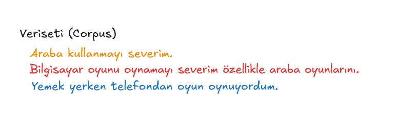

Veriseti 3 cümleden oluştuğunu görüyoruz. Gerçek LLM'ler yüzlerce GB veri ile eğitilir; burada anlatım kolaylığı için küçük bir örnek kullanılmıştır.

## 2. Verisetinde bulunan eşsiz kelimelerden Sözlük (Vocabulary) Oluşturma

Verisetindeki tüm eşsiz kelimeler bulunur:

$vocab size = count (set(N))$

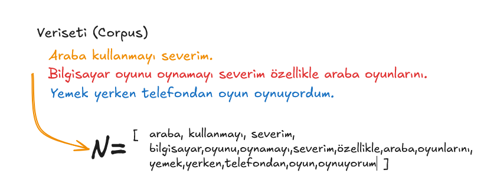

N  değerini bulduktan sonra tekrarlayan kelimleri temizleyerek gerçek sözlük boyutunu bulmamız gerekmektedir.

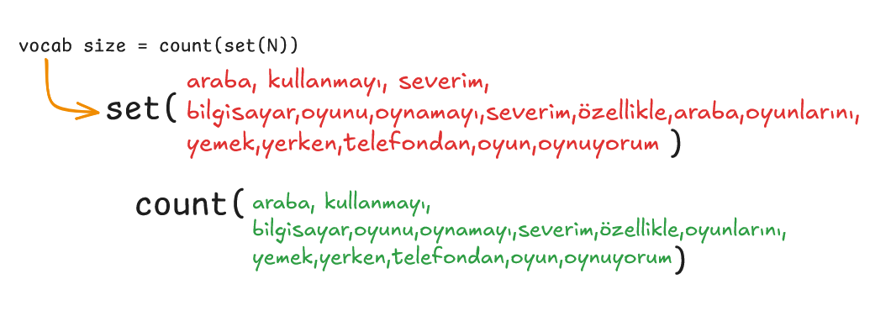

Gerçek modellerde bu sayı 50.000+ olabilir.


## 3. Tokenization ve Encoding
Her kelime benzersiz bir sayıya dönüştürülür.

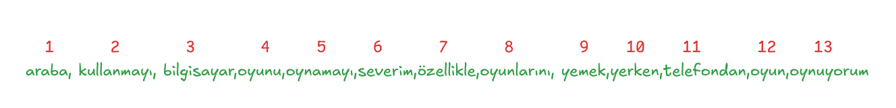

Model artık kelimelerle değil sayılarla çalışır. Bu aşamadan sonra artıkgirdi verisi seçerek transformer mimarisi üzerinde çalışabiliriz

Örnek:
```
"When you play game of thrones"  
→ [3, 15, 7, 9, 2, 11]
```

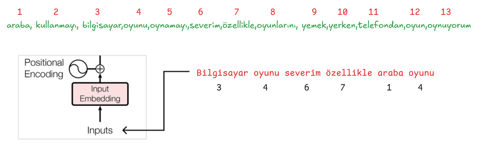


## 4. Embedding (Kelime Gömme)

Şimdi bu her tokenize edilmiş kelimenin karşılığına gelen bilgisayarın anlayabilmesi için vektöre çevirmemiz gerekiyor. Ve bunu sebepten  her token, d_model boyutunda bir vektöre dönüştürülür. Orjinal makalede  her girdi kelimesi için 512-boyutunda embedding vektörü kullanılmıştır. 
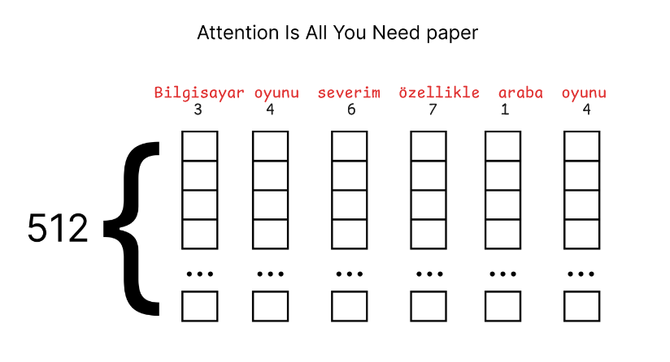

Orijinal makalede d_model = 512 kullanılmıştır.  

Bu çalışmada anlaşılabilirlik için 6 boyut kullanılmıştır.

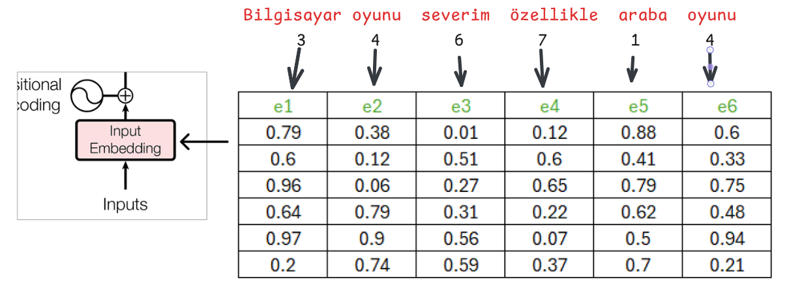

Embedding vektörleri:

- 0 ile 1 arasında başlangıçta rastgele atanır
- Eğitim sürecinde güncellenir
- Benzer kelimeler yüksek boyutlu uzayda birbirine yaklaşır

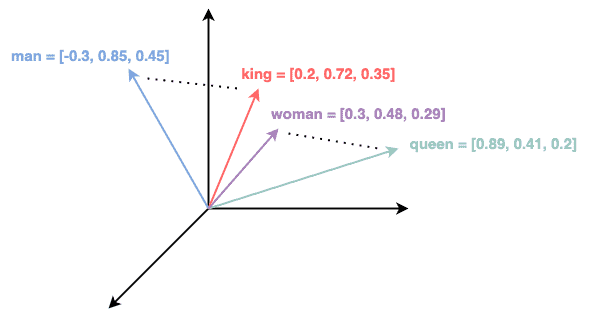

## 5. Positional Encoding (Konumsal Kodlama)
Transformer sıralı olmadığı için pozisyon bilgisi ayrıca eklenir. Girdilerin konumsal kodlamalarını bulmak için, 2 adet formül bulunmakta.

Formüller:
$PE(pos, 2i) = sin(pos / 10000^{2i/d})$

$PE(pos, 2i+1) = cos(pos / 10000^{2i/d})$

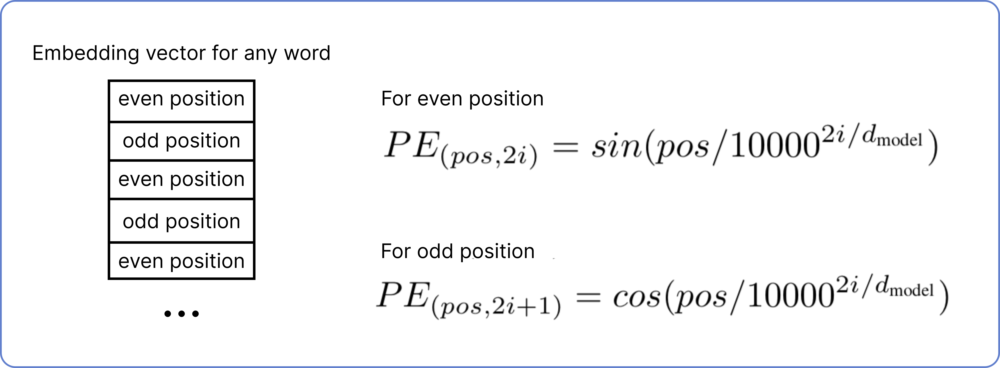

Cümlemiz **"When you play the game of thrones"** idi **When** kelimesini başlangıç index'i (POS) 0 ve 6 boyutlu boyuta sahip, 0 dan 5'e indexli olarak, ilk kelimemizin konumsal kodlamasını hesaplamak gerekirse girdi (input) cümlemizdeki (makaleye uygun olarak):

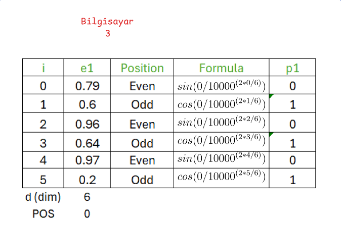

-   buradaki pos değeri pozisyon index değeridir tek ve çift olarak
-   i değeri index'i temsil etmekte
-   d değeri boyut değeri

$2i/d$ olarak hesaplanma sebebi dengeli bir frekans çıktısı sağlamak.

Anlaşıldığı üzere girdi cümlemizdeki tüm kelimelerin konumsal kodlamasını hesaplıyoruz:

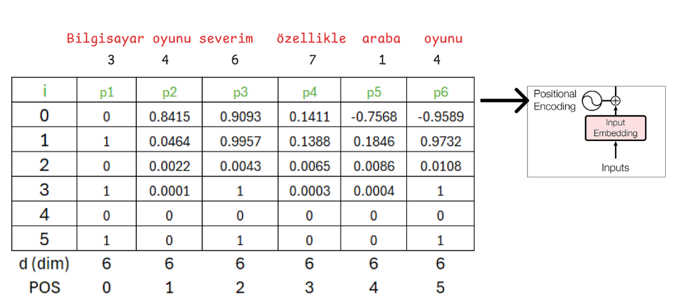

## 6.  Konumsal ve Kelime Embedding Vektörlerin Birleştirilmesi
Konumsal kodlamaları hesapladıktan sonra konumsal ve kelime embedding vektörlerinin toplamını alıyoruz.

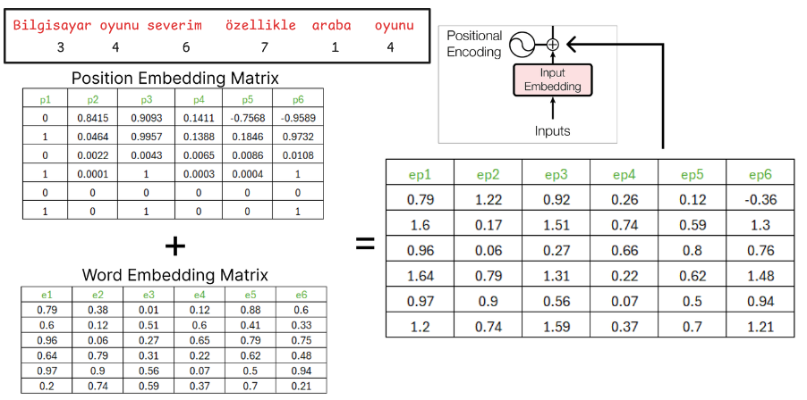

Özetle:
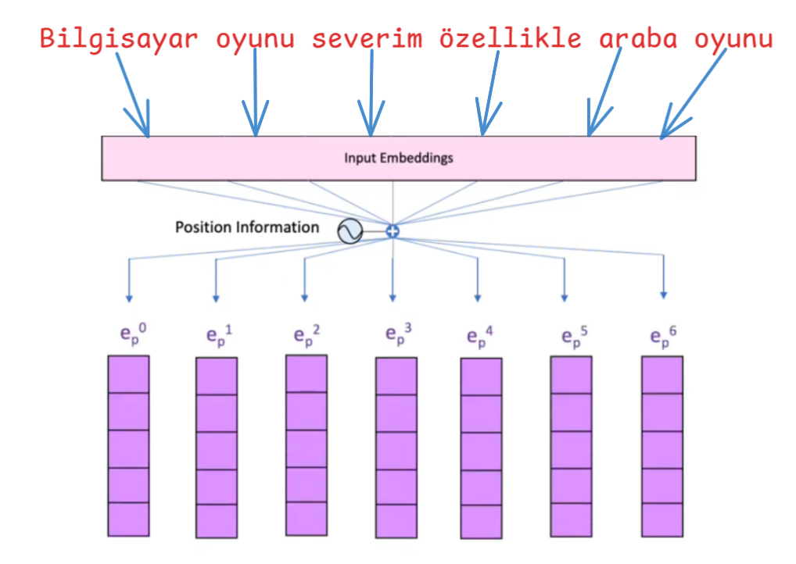

# 7. Multi-Head Attention

**Multi-Head Attention** mekanizması, birçok **Self-attention** mekanizmasından oluşur. Kaç tane **Self-attention** mekanizmasını birleştirmemiz gerektiği geliştiriciye kalmıştır. Örneğin, Meta'nın LLaMA LLM'si kodlayıcı mimarisinde 32 **Self-attention** mekanizması kullanmıştır. Aşağıda,**Self-attention** mekanizmasının nasıl göründüğünü gösteren şematik bir diyagram bulunmaktadır.

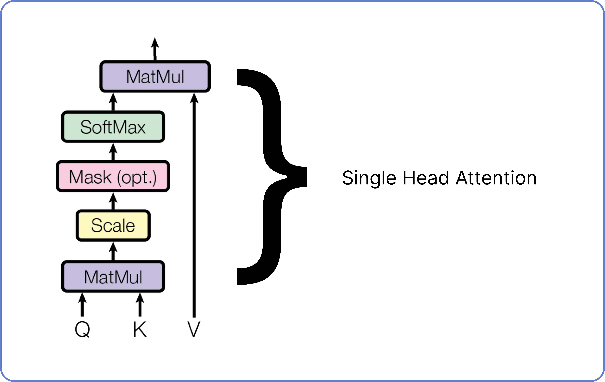

Temel dikkat mekanizması:

$Attention(Q,K,V) = softmax\left(\frac{QK^T}{\sqrt{d_k}}\right)V$

Burada:
- Q = Query
- K = Key
- V = Value

Temel olarak burada 3 Girdi bulunmakta **Q, K, V (Query, Key, Value)** bu matrislerin her biri, daha önce **kelime embedding ve konumsal embedding** matrislerini toplayarak hesapladığımız aynı matrisin **transpozunun** farklı bir ağırlık matrisi kümesiyle çarpılmasıyla elde edilir.

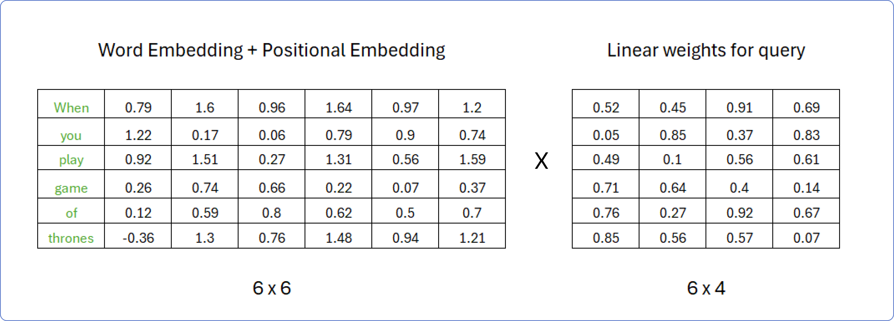

Örneğin, **Query** matrisini hesaplamak için, ağırlık matrisi kümesinin satır sayısı, **transpoz matrisinin sütun sayısıyla aynı olmalıdır**; ancak ağırlık matrisinin sütun sayısı **herhangi bir sayıda olabilir**; örneğin, ağırlık matrisimizde **4 sütun olduğunu varsayalım**. Ağırlık matrisindeki değerler ilk başta **0 ile 1** arasında **rastgele** seçilir ve bu değerler, dönüştürücümüz bu kelimelerin **anlamını öğrenmeye başladığında güncellenir**.

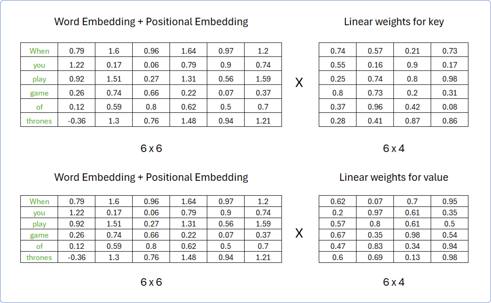

Benzer şekilde key ve value matrislerini aynı şekilde hesaplayabiliriz, fakat ağırlık matris değerleri farklı olmalıdır.

Matris çarpımları sonrası elimizde **query, key, values** değerleri olacaktır.

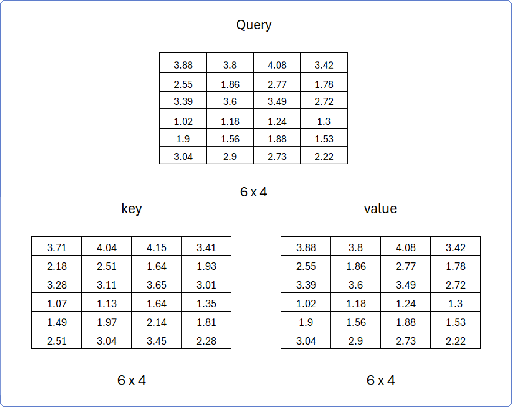

Şimdi Elimizde Bu **3** matris mevcut self-head attention hesaplıyalım adım adım **ilk adım** Q ve K matrisleri çarpımı:

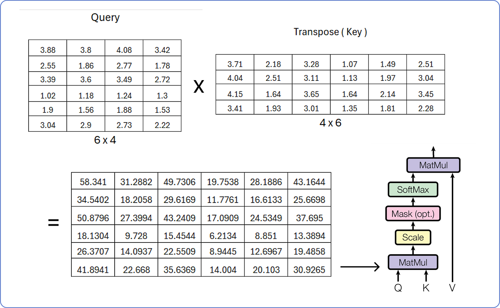

Elde edilen matrisi ölçeklendirmek için, embedding vektörümüzün boyutunu yani 6'yı yeniden kullanmalıyız.

$\frac{QK^T}{\sqrt{d_k}}$

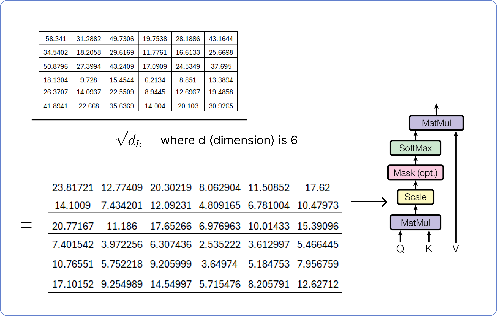

Maskeleme işleminin bir sonraki adımı **isteğe bağlıdır** ve bunu hesaplamayacağız. **Maskeleme**, modele belirli bir noktadan önce olanlara odaklanmasını ve bir cümledeki farklı kelimelerin önemini belirlerken geleceğe bakmamasını söylemek gibidir. Modelin, ileriye bakarak hile yapmadan, adım adım olayları anlamasına yardımcı olur.

Şimdi ölçeklendirilmiş sonuç matrisimize softmax işlemini uygulayacağız.

$softmax\left(\frac{QK^T}{\sqrt{d_k}}\right)$

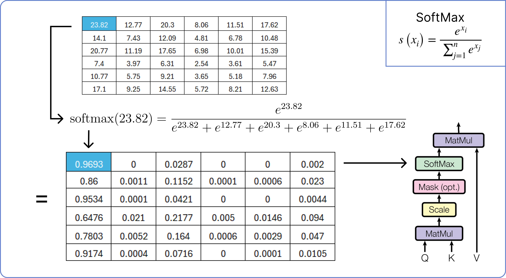

Son olarak single-head attention mekanizmasından elde edilen sonuç matrisini elde etmek için son çarpma adımını gerçekleştiriyoruz.

$Attention(Q,K,V) = softmax\left(\frac{QK^T}{\sqrt{d_k}}\right)V$

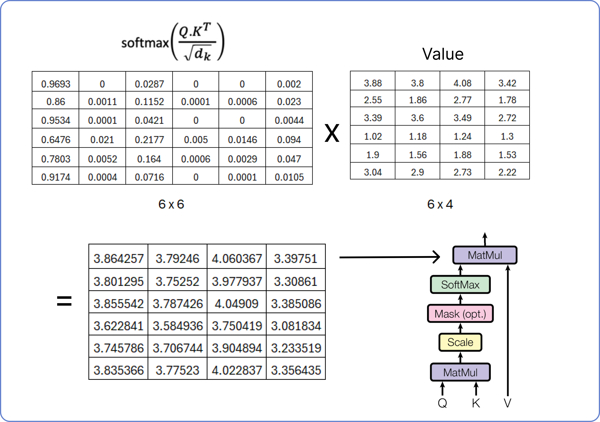

Daha önce belirtiğim gibi, şuana kadar **single-head attention hesapladık**, çok başlı dikkat ise **birçok tek başlı dikkatten oluşmaktadır** unutmamak gerekli. Aşağıda bunun görsel bir gösterimi yer almaktadır:

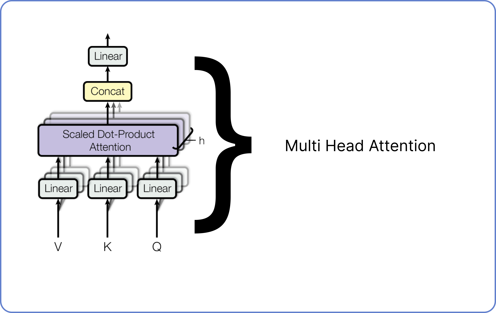

Multi-head attention olarka düşünürsek:
- Birden fazla attention head paralel çalışır
- Çıktılar birleştirilir (concatenate)
- Son lineer projeksiyon uygulanır

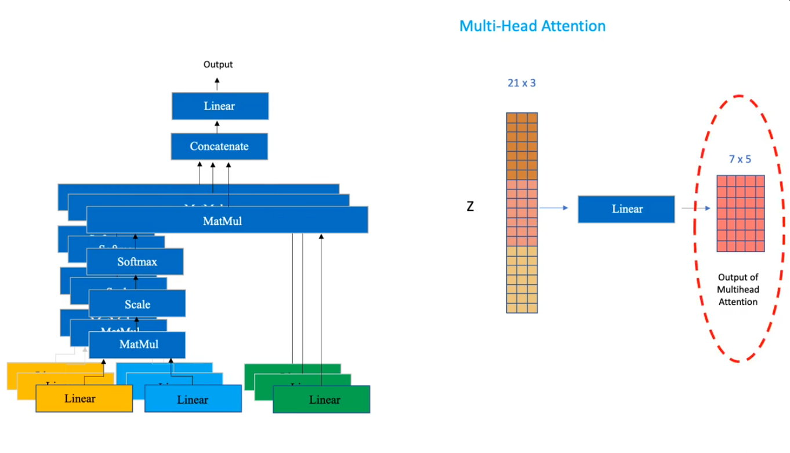


1.  Single-head attention girdileri **query, key ve value** olduğunu gördük ve her biri ayrı ağırlıklara sahip ve son çıktı matrisinin nasıl elde edildiğini gördük,
2.  Tek başlı dikkat mekanizmalarının tümü sonuç matrislerini ürettikten sonra, bunların hepsi birleştirilecek (concat) ve son birleştirilmiş matris,
3.  Rastgele değerlerle başlatılan bir dizi ağırlık matrisiyle çarpılarak tekrar doğrusal olarak dönüştürülecektir;
4.  Bu değerler daha sonra transformatör eğitime başladığında güncellenecektir.

Bizim durumumuzda **tek başlı bir dikkat mekanizmasını ele alıyoruz**, ancak çok başlı dikkat mekanizmasıyla çalışırken durum **böyle görünecektir:**

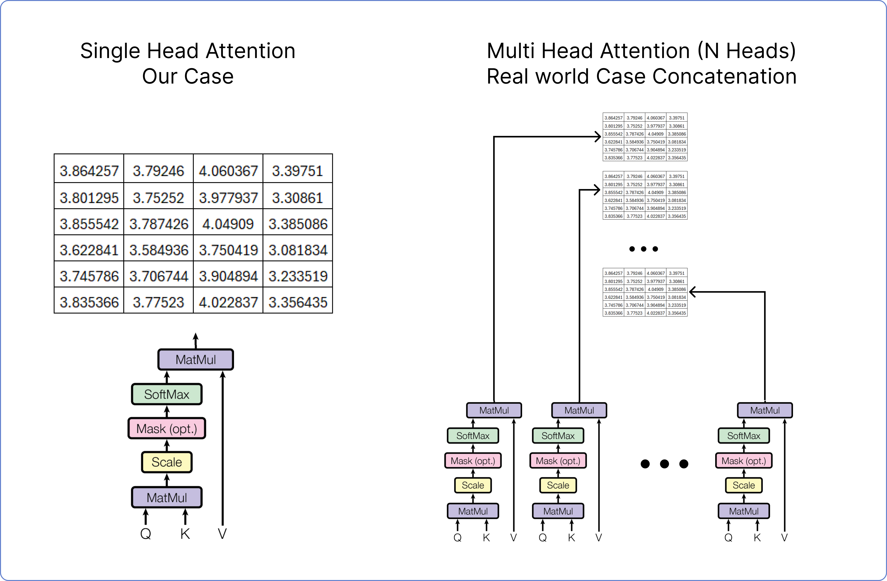

Her iki durumda da, ister self-head ister multi-head attention mekanizması olsun, elde edilen matrisin bir dizi ağırlık matrisiyle çarpılarak tekrar doğrusal olarak dönüştürülmesi gerekir.


Doğrusal (Linear) ağırlık matrisinin sütun sayısının, daha önce hesapladığımız **(kelime embedding+ konumsal embedding)** matrisinin sütun sayısına **eşit olduğundan emin olun**, çünkü bir sonraki adımda, elde edilen normalize edilmiş matrisi (kelime embedding+ konumsal embedding) matrisiyle **toplayacağız.**


Çok başlı dikkat mekanizması için sonuç matrisini hesapladığımıza göre, bir sonraki adımda toplama ve normalleştirme işlemlerine geçeceğiz.

# 8. Toplama ve Normalize etme (Adding and normalizing)
Multi-head veya Self-head attention mekanizması ile elde ettiğimiz sonuç matrisini, orjinal **(word embedding + positional embbeding)** **girdi** matrisi ile topluyoruz:

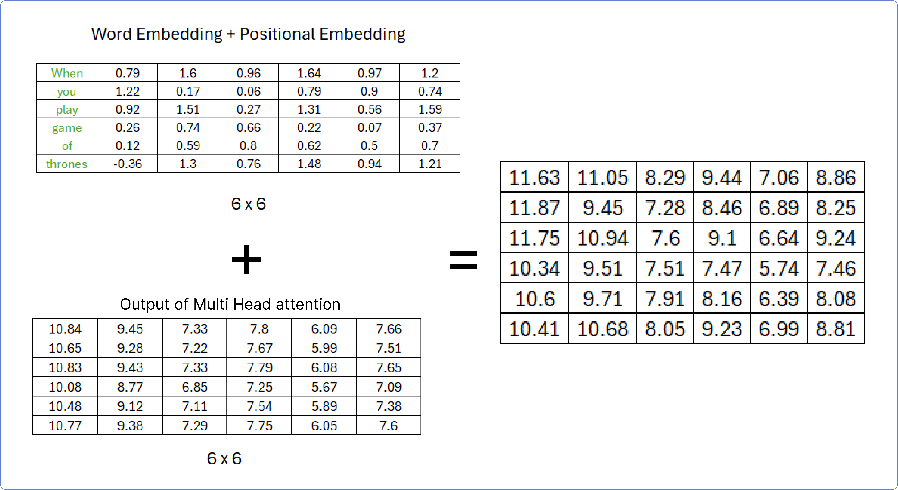

Elde ettiğimiz toplam martisini, ortalama ve standart sapmasını hesaplıyoruz her satır için:
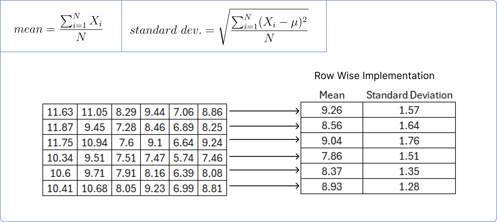

Elde edilen ortalama ve standart sapma matrisi ile sonuç matrisini çıkartma işlemi yapılarak standard sapma değerine bölünür:
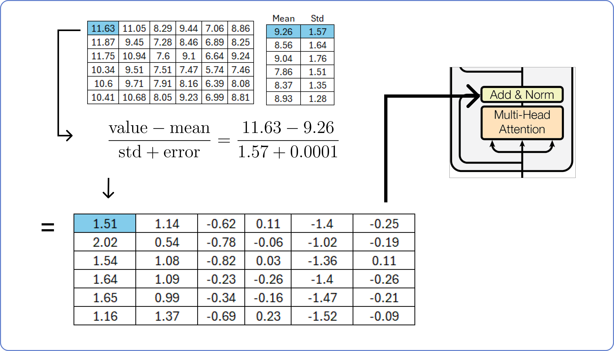

Küçük bir **hata payı** eklemek, paydanın sıfır olmasını engeller ve tüm terimin sonsuz olmasını önler.

Bu residual bağlantı eğitimi stabil hale getirir.


# 9. Feed Forward Network veya Multi Layer Perceptron

Matrisi normalize ettikten sonra artık ileri beslemeye sokarız bu aşamada **linear layer ve bir tane ReLU aktivasyon fonksiyonu** kullanıyoruz örneğin kolay olması için.

Her token bağımsız olarak şu yapıdan geçer:

$FFN(x) = W_2(ReLU(W_1 x + b_1)) + b_2$

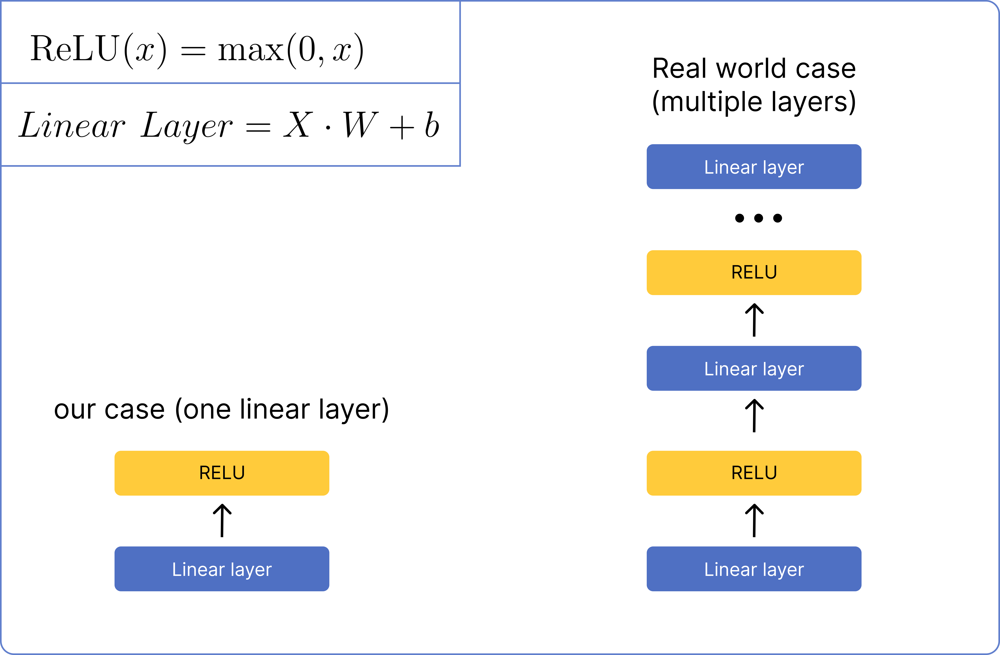


Öncelikle, son hesapladığımız matrisi, transformatör öğrenmeye başladığında güncellenecek olan **rastgele bir ağırlık matrisi kümesiyle çarparak** ve elde edilen matrisi, yine **rastgele değerler içeren bir sapma(bias)** matrisine ekleyerek doğrusal katmanı hesaplamamız gerekiyor.

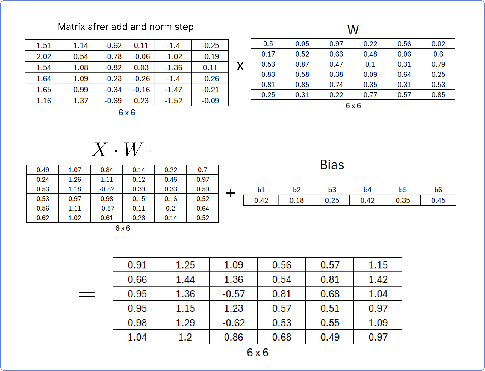

Linear katman hesaplamasından sonra **ReLU** katmanından geçirilir

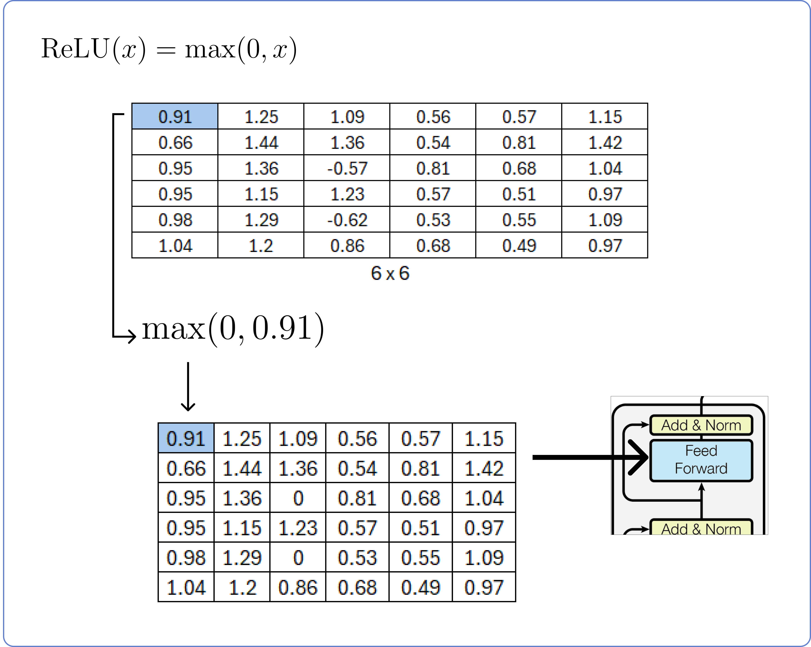

# 10. Tekrardan Toplama ve Normalize etme adımı
İleri besleme ağından **elde ettiğimiz matris** ile **daha önceden elde** ettiğimiz önceki toplama ve normalize etme adımında matris **toplanır** ve **satır bazlı ortalama ve standart sapma hesaplanır**


Bu toplama ve normalleştirme adımının **çıktı matrisi**, **decoder** bölümünde bulunan çok başlı dikkat mekanizmalarından birinde **query ve key matrisi** olarak görev yapacaktır; bunu, toplama ve normalleştirme adımlarından **kod çözücü(decoder)** bölümüne doğru izleyerek kolayca anlayabilirsiniz.

# Encoder Çıkışı
Encoder sonunda elde edilen:

$H_{enc} \in \mathbb{R}^{n \times d}$

Bu, bağlamsal temsil matrisidir.
# 11. Decoder Yapısı

Decoder üç ana bölümden oluşur:

1. Masked Multi-Head Attention
2. Cross Attention
3. Feed Forward Network

İyi haber şu ki, şimdiye kadar **Kodlayıcı(Encoder)** kısmını hesapladık; veri setimizi kodlamaktan matrisimizi ileri beslemeli ağdan geçirmeye kadar gerçekleştirdiğimiz tüm adımlar benzersiz. Yani bunları daha önce hesaplamadık. Ancak bundan sonra, transformatörün geri kalan mimarisi olan **Kod Çözücü(Decoder)** kısmı, benzer türde matris çarpımlarını içerecektir.

Transformatör mimarimize bir göz atın. Şimdiye kadar neler ele aldık ve neler ele almamız gerekiyor:
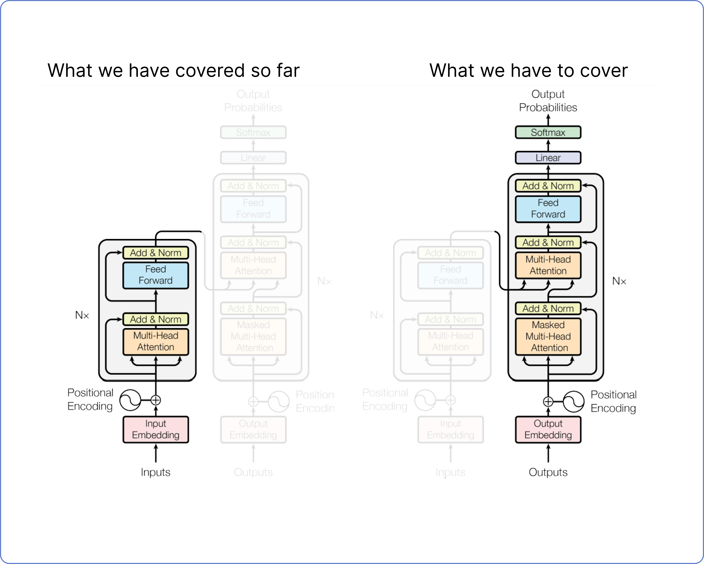

**Kod çözücünün tamamını hesaplamayacağız** çünkü büyük bir kısmı, kodlayıcıda zaten yaptığımız hesaplamalara **benzer** hesaplamalar içeriyor. Kod çözücüyü ayrıntılı olarak hesaplamak, tekrarlayan adımlar nedeniyle blogu uzatacaktır. Bunun yerine, **sadece kod çözücünün giriş ve çıkışının hesaplamalarına odaklanmamız gerekiyor.**

Eğitim sırasında, kod çözücüye iki giriş vardır. Biri kodlayıcıdan gelir; burada son toplama ve normalleştirme katmanının çıktı matrisi, kod çözücü kısmındaki ikinci çok başlı dikkat katmanı için sorgu ve anahtar görevi görür. Aşağıda bunun görselleştirilmesi yer almaktadır (** [https://www.youtube.com/watch?v=gJ9kaJsE78k&t=596s](https://www.youtube.com/watch?v=gJ9kaJsE78k&t=596s) **'dan):

Model:

1.  Verisetindeki hedefleri görür
2.  Hata yapar
3.  Hata düzeltilir
4.  Ağırlıklar güncellenir
5.  Bu tekrar eder Sonunda:
6.  Model artık benzer girdiler için doğru çıktıyı üretebilir hale gelir. Yani **decoder input** verisetindeki kelimelerden cümlelerden işlemler gerçekleştirir


Değer(Value) matrisi, ilk **toplama ve normalleştirme** adımından sonra kod çözücüden gelir.

Kod çözücünün ikinci girdisi ise **tahmin edilen metindir**. Hatırlarsanız, kodlayıcıya **(encoder)** girdimiz "When you play game of thrones" idi, bu nedenle kod çözücüye girdi tahmin edilen metindir, yani bizim durumumuzda **"you win or you die".**

Ancak **tahmin edilen girdi metninin(input text)**, dönüştürücünün nerede başlayıp nerede biteceğini anlamasını sağlayan standart bir belirteç dizilimini takip etmesi gerekir.

Sahte ama sabit bir başlangıç sinyali.

Düşün: Bir yazı yazdırma robotu var.

Diyorsun ki:

-   “Yazmaya başla.”
-   Ama ilk harfi söylemiyorsun.

Robot:

-   Nereden başlasın?
-   Büyük harf mi?
-   Küçük harf mi?

= “Şimdi üretim başladı” sinyali.

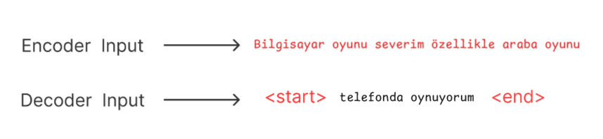

Burada ve iki yeni belirteç tanıtılıyor. Dahası, **decoder** her seferinde yalnızca bir belirteci girdi olarak alıyor. Bu, girdi olarak sunulacağı ve sizin de bunun için tahmin edilen metin olmanız gerektiği anlamına gelir.

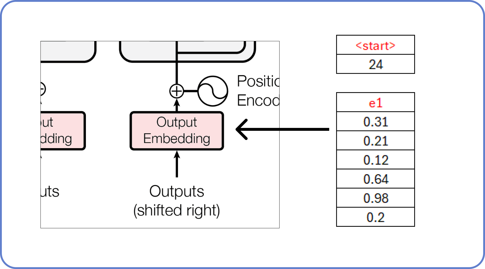

Daha önce de bildiğimiz gibi, bu embedding vektörler rastgele değerlerle doldurulur ve bu değerler daha sonra eğitim sürecinde güncellenir.

Geri kalan blokları, kodlayıcı bölümünde daha önce hesapladığımız şekilde hesaplayın.

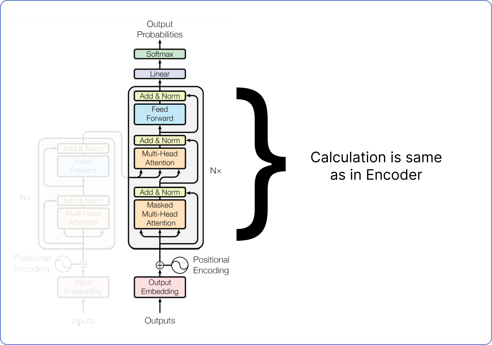

Daha ileri detaylara girmeden önce **_masked multi-head attention_** basit matematik ile anlaşılması gerekir.


# 12 Masked Multi-Head Attention

Bu adım aslında decoder'da geleceğe bakmayı engeller.
Masked Multi-Head Attention, decoder’da gelecekteki token’lara bakmayı engelleyen (look-ahead/causal) attention’dır.

| Normal Attention      | Masked Attention      |
| --------------------- | --------------------- |
| Herkes herkesi görür  | Gelecek gizlenir      |
| Encoder’da kullanılır | Decoder’da kullanılır |
| Çeviri input tarafı   | Üretim tarafı         |

“Bir sonraki kelimeyi tahmin ederken geleceği görmeyi engelleyen attention mekanizmasıdır.”

Transformer modellerinde, **masked multi-head attention mekanizması**, modelin cümlenin **farklı bölümlerine odaklanmak** için kullandığı bir **spot ışığı** gibidir. Bu mekanizma özeldir çünkü modelin cümlenin ilerleyen kısımlarındaki kelimelere bakarak **hile yapmasını engeller.** Bu, modelin cümleleri adım adım anlamasına ve oluşturmasına yardımcı olur; bu da konuşma veya kelimeleri başka bir dile çevirme gibi görevlerde önemlidir.

Aşağıdaki girdi matrisine sahip olduğumuzu varsayalım; burada her satır dizideki bir pozisyonu, her sütun ise bir özelliği temsil etmektedir.

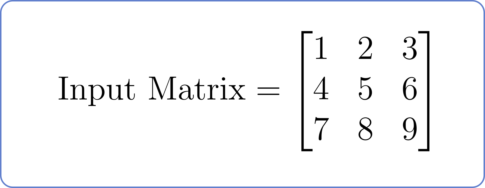

Şimdi, **masked multi-head attention** bileşenlerini anlayalım:

1.  **Doğrusal(Linear) Projeksiyonlar (Sorgu Query, Anahtar Key, Değer Value):** Her head için Linear projeksiyonları varsayalım: ve
2.  **Dikkat Puanlarını(Attention Scores) Hesapla:** Her head için, Query ve Key nokta çarpımını kullanarak attenion score hesaplayın ve gelecekteki konumlara dikkat etmeyi önlemek için maskeyi uygulayın.
3.  **Softmax Uygula:** Dikkat ağırlıklarını elde etmek için softmax fonksiyonunu uygulayın.
4.  **Ağırlıklı Toplam (Değer):** Her kafa için ağırlıklı toplamı elde etmek için dikkat ağırlıklarını Değer ile çarpın.
5.  **Birleştir ve Doğrusal Dönüşüm:** Her iki kafadan gelen çıktıları birleştirin ve doğrusal bir dönüşüm uygulayın.

**Basitleştirilmiş bir hesaplama yapalım:**
İki koşulu varsayalım:
$Wq1​ = Wk1 ​= Wv1 ​= Wq2​ = Wk2 ​= Wv2​ = I$, birim matris.

$Q=K=V=Giriş Matrisi$

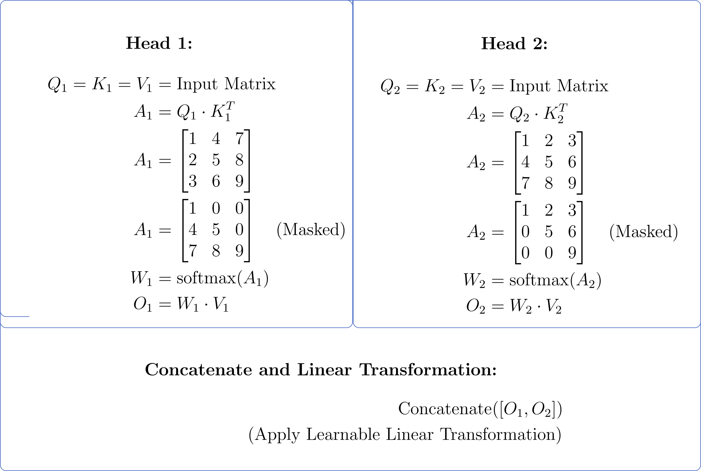


Birleştirme adımı, multi-head attention mekanizmasının çıktılarını tek bir bilgi kümesinde birleştirir.

Bir sorun hakkında size tavsiye veren iki arkadaşınız olduğunu düşünün. Tavsiyelerini birleştirmek, her iki tavsiyeyi de bir araya getirerek ne önerdiklerine dair daha eksiksiz bir bakış açısı elde etmeniz anlamına gelir. Transformer modeli bağlamında, bu adım, girdi verilerinin farklı yönlerini birden fazla perspektiften yakalamaya yardımcı olur ve modelin daha fazla işlem için kullanabileceği daha zengin bir temsile katkıda bulunur.

# Son Tahmin Aşaması
Kod çözücünün(decoder) **son** toplama ve normalleştirme bloğunun çıkış matrisi, giriş matrisiyle aynı sayıda satıra sahip olmalıdır, ancak sütun sayısı herhangi bir değer olabilir. Burada 6 ile çalışıyoruz.

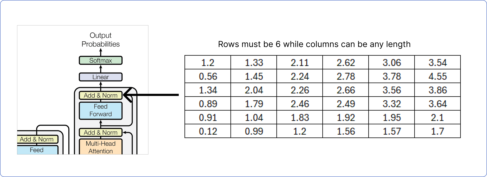

Kod çözücünün **(Decoder)** son toplama ve normalleştirme bloğunun **(add and norm)** sonuç matrisi, veri setimizdeki **(metin kümesindeki)** her benzersiz kelimenin tahmini **olasılığını** bulmak için doğrusal bir katmanla **(linear layer)** eşleşecek şekilde düzleştirilmelidir. **örneğin 4x4 matris her satır yan yana konularak birleştirilir (concatenate) edilir**

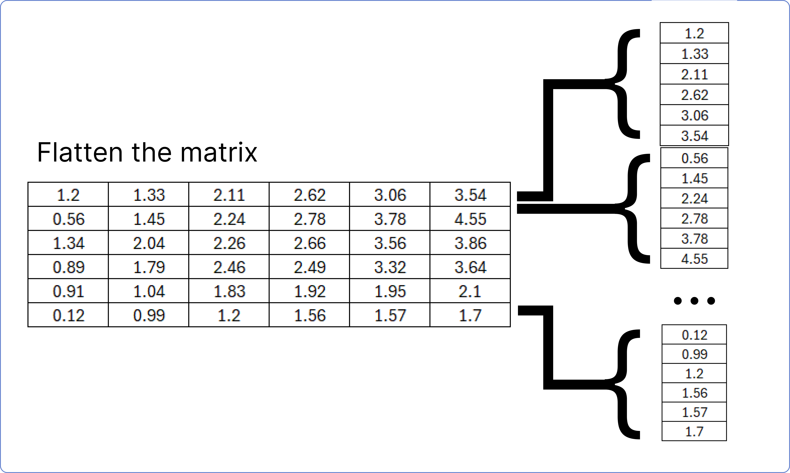

Bu **düzleştirilmiş katman**, veri setimizdeki **her benzersiz kelimenin logitlerini (puanlarını) hesaplamak** için doğrusal bir katmandan **(linear layer)** geçirilecektir.


Logit değerlerini elde ettikten sonra, **softmax** fonksiyonunu kullanarak bunları normalleştirebilir ve **en yüksek olasılığa sahip kelimeyi bulabiliriz.**


Hesaplamalar sonunda tahmin edilen **kelimeyi elde ederiz.**

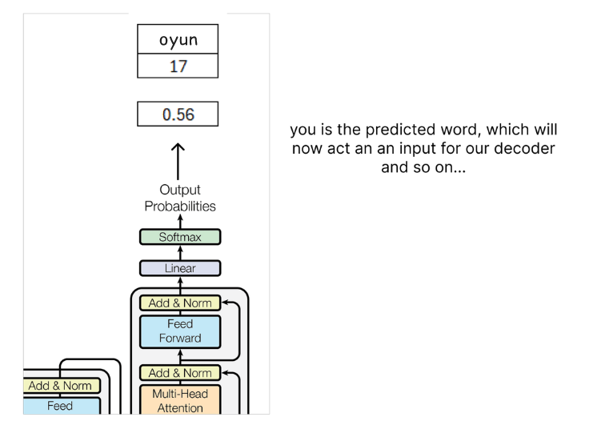

**Tahmin edilen bu kelime ("you"),** kod çözücü için giriş kelimesi olarak kabul edilecek ve bu işlem, kelime tahmin edilene kadar devam edecektir.

Önemli Noktalar

1.  Yukarıdaki örnek çok basittir, çünkü Python gibi bir programlama dili kullanılarak görselleştirilebilen dönemleri veya diğer önemli parametreleri içermez.
2.  Sadece eğitime kadar olan süreci göstermiştir; değerlendirme veya test, bu matris yaklaşımı kullanılarak görsel olarak görülemez.
3.  Maskelenmiş çok başlı dikkat mekanizmaları, transformatörün geleceğe bakmasını engelleyerek modelinizin aşırı uyumunu önlemeye yardımcı olabilir.


# Önemli Notlar

- Transformer sıralı hesaplamayı ortadan kaldırır.
- Attention global bağımlılıkları yakalar.
- Masking, geleceğe bakmayı engeller.
- Encoder bağlam oluşturur.
- Decoder üretim yapar.
- Model üretim sırasında verisetine bakmaz; yalnızca öğrenilmiş ağırlıkları kullanır.
- Veriseti hazırlama, Training, Cross-Validation, Autoregressive generation, Instruction turning, RLHF ve benzeri konular burada anlatılmamıştır sadece Transformers mekanizmasının çalışma mantığı açıklanmaya çalışılmıştır.


# Referanslar

1. Attention Is All You Need (2017) https://arxiv.org/pdf/1706.03762
2. FareedKhan-dev GitHub matematiksel örnek https://github.com/FareedKhan-dev/best-introduction-to-transformer
3. Kazemnejad Positional Encoding açıklaması https://kazemnejad.com/blog/transformer_architecture_positional_encoding/
4. Çeşitli görsel Transformer anlatımları
5. Understanding Positional Encoding in Transformers https://erdem.pl/2021/05/understanding-positional-encoding-in-transformers


